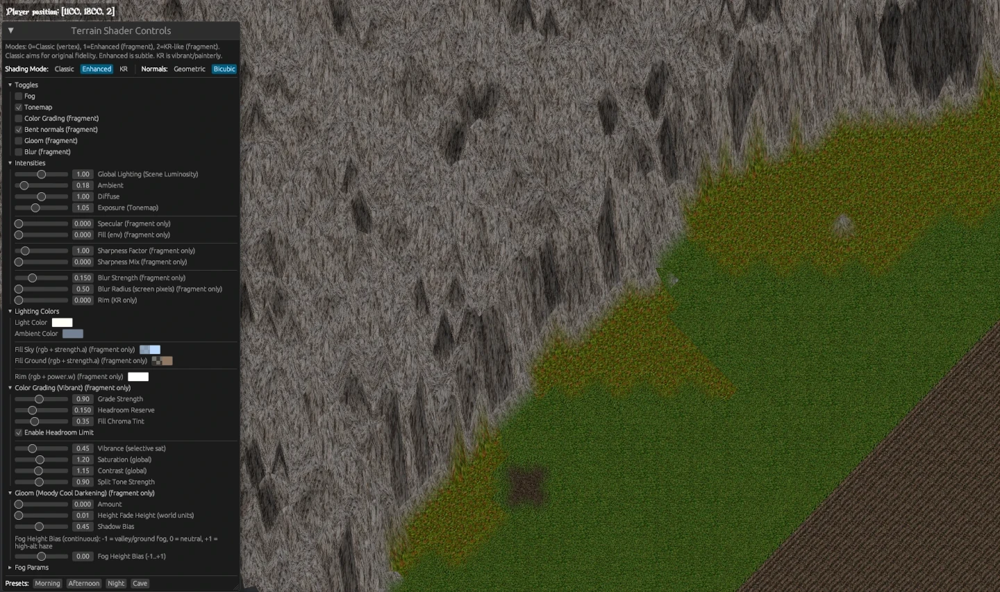

# UODynamapper

Ultima Online dynamic map renderer, at a very early stage.

## Running

- Download Rust toolchain.
- Run `cargo build` in the project root folder.
- Edit the UO files directory in `assets/settings.toml`.

## Current status

Renders land tiles, move around the map, play around with shader settings.  

Read [TODO](docs/TODO.md) for next developments.
Read [CODE_OVERVIEW](docs/CODE_OVERVIEW.md) for a rapid overview of the project architecture.
