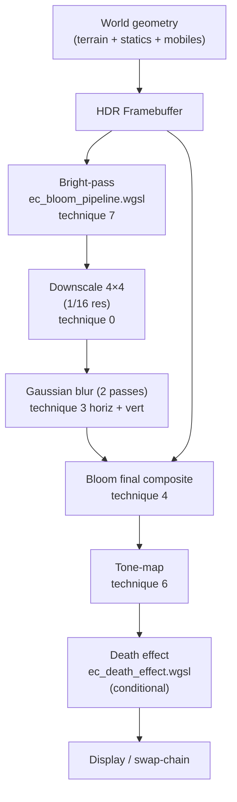

# EC Post-Processing & Sprite Shaders — WGSL Translation Reference

Translated from the Mythic Package Editor EC shader dump (`Shaders.uop_B0_F*.txt`).
All files live in `dynamapper/assets/shaders/postprocess/`.

---

## Pipeline Overview



---

## Files Created

| File | Source shader(s) | Applied on |
|------|-----------------|-----------|
| [ec_bloom_pipeline.wgsl](file:///mnt/dati/__cloud/mega/_proj/_Rust/UODynamapper/dynamapper/assets/shaders/postprocess/ec_bloom_pipeline.wgsl) | F6 (all techniques) | Full screen — after main render |
| [ec_death_effect.wgsl](file:///mnt/dati/__cloud/mega/_proj/_Rust/UODynamapper/dynamapper/assets/shaders/postprocess/ec_death_effect.wgsl) | F4 | Full screen — on player death |
| [ec_sprite_hue.wgsl](file:///mnt/dati/__cloud/mega/_proj/_Rust/UODynamapper/dynamapper/assets/shaders/postprocess/ec_sprite_hue.wgsl) | F11 | Per-sprite fragment (hued entities) |
| [ec_sprite_base.wgsl](file:///mnt/dati/__cloud/mega/_proj/_Rust/UODynamapper/dynamapper/assets/shaders/postprocess/ec_sprite_base.wgsl) | F0, F2, F5, F8, F10 | Per-sprite vertex + fragment (all sprites + UI) |

---

## Shader-by-Shader Breakdown

### `ec_bloom_pipeline.wgsl` — Screen-space post-process (F6)

The main HDR post-process pipeline. Contains **9 technique variants**:

| Index | Name | What it does |
|-------|------|-------------|
| 0 | `downscale_4x4` | 16-tap box filter → 1/16 resolution. First stage of bloom (feeds blurring). |
| 1 | `gauss_blur_5x5` | 13-tap weighted Gaussian (separable, called twice for H + V). Blurs the bright-pass result. |
| 2 | `downscale_2x2` | 4-tap box filter → 1/4 resolution. Lighter alternative to 4×4 downscale. |
| 3 | `bloom` | 15-tap one-axis Gaussian (H or V pass). Core bloom blur kernel. |
| 4 | `bloom_final` | Composites blurred bloom onto scene: `scene + bloom * BLOOM_SCALE`. |
| 5 | `monochrome` | Rec.709 luma collapse → full greyscale. General desaturation effect. |
| 6 | `tonemap` | Reinhard-with-shoulder HDR→LDR: `L * middleGrey / (avgLuma + ε) * shoulder / (1+shoulder)`. |
| 7 | `bright_pass` | Extracts bright regions for bloom: same curve as tonemap, then `max(0, L−5) / (10+…)`. |
| 8 | `test_passthrough` | Identity / debug pass. |

**Key constants** (match EC originals):
```wgsl
const LUMA_SCALE:     f32 = 0.1;   // attenuation during downscale
const LUMINANCE:      f32 = 2.0;   // scene average luma estimate (tone-mapper)
const BLOOM_SCALE:    f32 = 2.0;   // bloom intensity
const F_MIDDLE_GRAY:  f32 = 0.18;  // Reinhard middle-grey
const F_WHITE_CUTOFF: f32 = 0.8;   // Reinhard white-point
```

> [!NOTE]
> In the original EC code, `bloom_final` was computing only `bloom * BLOOM_SCALE` (the additive
> scene composite was commented out). The actual composite was done via GPU blend state
> (additive blending). The WGSL version includes both variants; see the comment in the file.

---

### `ec_death_effect.wgsl` — Greyscale death screen (F4)

A dedicated screen-space greyscale filter. Identical in effect to technique 5 (monochrome) above,
but was a separate compiled shader in the EC — toggled on/off by game logic when the player dies.

**Enhancement over original:** Added a `strength` uniform (0.0→1.0) so UODynamapper can
**fade the effect in/out** smoothly rather than a hard binary switch.

```wgsl
out_rgb = mix(color.rgb, grey, params.strength); // 0 = colour, 1 = grey
```

---

### `ec_sprite_hue.wgsl` — Hue-remapping fragment (F11)

The most complex sprite shader. Handles the entire **UO palette/hue system**:

1. **Sample sprite texture** at `texCoord0` (atlas UV).
2. **Hue lookup**: compute `luma = dot(rgb, Rec709)` → use as X-offset into
   a 1D palette row. The palette row is indexed by `texCoord2.x` (the entity's
   hue index / 1024). Replaces the pixel's RGB with the palette colour.
3. **Ethereal shift**: adds `(0, 0.01, 0.025)` blue bias for ghost entities.
4. **Alpha modulation** by vertex diffuse alpha (fade, stealth, etc.).

**Hue texture format** (2D RGBA8):
- Width: 256 px × N hue groups
- Height: 1024 rows (one palette per row)
- CPU pre-computes `hue_pixel_uv_offset = (1/1024) * 255 ≈ 0.249`

**Compile-time flags → runtime uniforms** (HLSL permutations → WGSL uniform):
```wgsl
has_hue:     u32  // 1 = perform hue lookup
is_ethereal: u32  // 1 = add blue-shift
```

---

### `ec_sprite_base.wgsl` — Sprite vertex shaders + base fragment (F0/F2/F5/F8/F10)

Three vertex shader variants + one fragment shader:

#### Variant A — World sprite (F2 + F0)
Standard billboard: `worldTransform (4×3) → viewProjMatrix (4×4)`. UVs pass-through.
Applied on: all non-animated sprites, ground items, statics.

#### Variant B — Effect sprite (F5 + F11)
Same world transform + applies **3×3 affine UV transforms** to sprite and grunge UVs:
```wgsl
tex_coord0 = effectTransform * vec3(uv, 1)   // scroll/rotate sprite UV
tex_coord1 = grungeTransform * vec3(uv, 1)   // separate grunge detail UV
```
Applied on: spell effects, particles, animated character effects.

#### Variant C — Screen-space UI (F10 + F0)
Pixel→NDC transform **without** a view matrix:
```
ndcx = pixel.x * (2/width)  + (offset_x * 2/width  - 1)
ndcy = 1 - (pixel.y * (2/height) + (offset_y * 2/height - 1))
```
Applied on: all HUD, gump windows, buttons, cursor sprites.

#### Fragment (F0)
```wgsl
if use_texture: output = textureSample(...) * vertex_color
else:           output = vertex_color
```

---

## Important Translation Notes

| HLSL convention | WGSL equivalent |
|----------------|-----------------|
| `mul(vec4, mat4x3)` (row-vec × matrix) | `mat4x3 * vec4` (column-major; transpose on CPU upload) |
| `mul(float3(uv, 1), mat3x3)` | `mat3x3 * vec3(uv, 1)` (same note) |
| `tex2D(sampler, uv)` | `textureSample(texture, sampler, uv)` |
| `half` / `half3` / `half4` | `f32` / `vec3<f32>` / `vec4<f32>` (WGSL has no f16 in standard WGSL 1.0) |
| `discard` (implicit via `clip()`) | `discard;` (explicit statement) |
| `static const` | `const` (module scope) |
| Compile-time `#define` / `#if` permutations | Dynamic `u32` uniforms (equivalent perf on modern GPUs) |

> [!IMPORTANT]
> The `worldTransform` in HLSL is `float4x3` with **row-major** storage and
> `mul(row_vec, matrix)` semantics. In WGSL `mat4x3<f32>` is **column-major**
> (`mat4x3` = 4 columns × 3 rows). The CPU must **transpose** when uploading.
